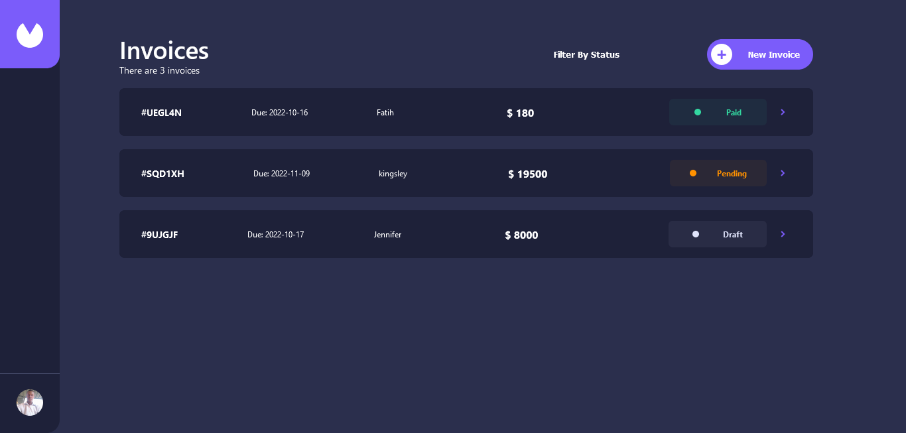

# Reactjs Invoice App

This is the solution for [Frontend Mentor Invoice App](https://www.frontendmentor.io/challenges/invoice-app-i7KaLTQjl). You can keep track of your personal invoices with this app. You can create a new invoice, save it as a draft or as pending, mark pending invoices as paid and edit any draft or pending invoices. Also you can filter the invoices by their draft/pending/paid status.

I used localstorage to ensure the invoice created persists after refreshing browser.

### Screenshots:



## This project is built with:

- Frontend Framework: [ReactJs](https://reactjs.org/),
- For state management: [Redux Toolkit](https://redux-toolkit.js.org/),
- For routing: [React Router](https://reactrouter.com/),
- For Storage: [localstorage](https://developer.mozilla.org/en-US/docs/Web/API/Window/localStorage/),

## Table of contents

- [Overview](#overview)
  - [The challenge](#the-challenge)
  - [Links](#links)
- [My process](#my-process)
  - [Built with](#built-with)
- [Author](#author)
- [Project Setup](#project-setup)

## Overview

### The challenge

Users should be able to:

- View the optimal layout for the app depending on their device's screen size
- See hover states for all interactive elements on the page
- Create, read, update, and delete invoices
- Receive form validations when trying to create/edit an invoice
- Save draft invoices, and mark pending invoices as paid
- Filter invoices by status (draft/pending/paid)
- Bonus: Used Localstorage to make invoice persist after refresh or when browser is closed.

### Links

- Solution URL: [Github Link](https://github.com/Kingsleyaham/react-invoice-app)
- Live Site URL: [React Invoice App](https://react-invoice-app-proj.netlify.app/)

## Author

- Portfolio - [Kingsleyaham](https://github.com/Kingsleyaham/)
- Linkedin - [Kingsley Aham](https://www.linkedin.com/in/kingsley-aham-282a51225/)
- Twitter - [Aham Kingsley](https://twitter.com/aham_kingsley8/)

## Project setup

```
npm install
```

### Compiles and hot-reloads for development

```
npm run start
```

### Compiles and minifies for production

```
npm run build
```
